<h3 align="center">THE BRIEF</h3>

I'm <b>Demilade Akinyemi</b> — a founding-style full-stack engineer who takes products from idea to launch. 
MVPs, dashboards, real-time systems, backend APIs, and interfaces that don't just work, they <i>vibe</i>. 
I care about clean architecture and button hover states in equal measure. Currently building <a href="https://www.dev-byte.dev">Devbyte</a>.

<h3 align="center">THE STACK</h3>

LANGUAGES 

  
FRONTEND 

  
BACKEND AND DATA 

  
TOOLS AND CLOUD 

<h3 align="center">SHIPPED</h3>

  

<b><a href="https://www.dev-byte.dev">dev-byte.dev</a></b> — my portfolio. React 19 · TypeScript · Tailwind v4 · GSAP · three.js, 
with a live Spotify "now playing" widget served by Vercel serverless functions.

<h3 align="center">THE NUMBERS</h3>

<!-- snake.svg is generated by .github/workflows/snake.yml and served from the `output` branch.
     It shows as a broken image until that Action has run once (Actions tab -> Snake -> Run workflow). -->

<!-- The stats + top-langs cards use the PUBLIC github-readme-stats instance, which can rate-limit (HTTP 503).
     For 100% uptime, self-host github-readme-stats and swap the host in both URLs (see the setup notes). -->

<h3 align="center">SIGNAL</h3>

  

